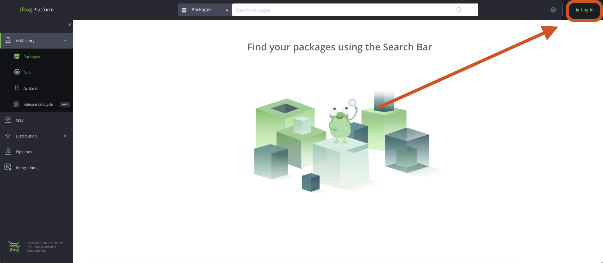
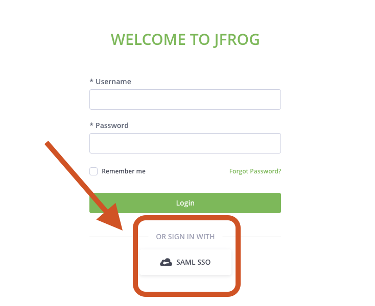
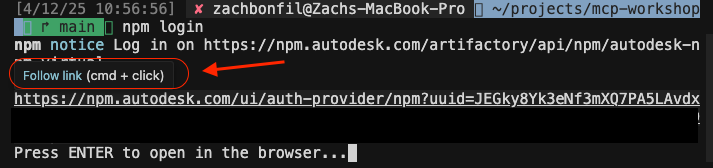

# Prerequisites (Non-Engineer Track)

## Goal

Verify that Node.js is installed and npm is authenticated to the Autodesk registry.

## Before You Start: NPM Authentication Setup

Before running the prompt, you need to login to JFrog manually. This prevents "Token Generation Prohibited" errors.

### Step 1: Connect to VPN

Make sure you are connected to **GlobalProtect** VPN (the globe icon, not the key icon).

### Step 2: Login to JFrog in Browser

1. Navigate to [https://npm.autodesk.com/](https://npm.autodesk.com/)

2. Click the **Log in** button in the top right corner:



3. Click **SAML SSO** to login with your Autodesk credentials:



Once logged in, you're ready to run the prompt below.

---

## Prompt

Copy and paste this entire prompt into Cursor:

```
I need you to check if Node.js is installed on my system, help me install it if needed, and then authenticate npm with the Autodesk registry.

Step 1: Check current installation

Run these commands and tell me the output:
node --version
npm --version

Step 2: Evaluate the results

- If both commands show version numbers (e.g., v20.10.0 and 10.2.0), Node.js is installed
- If the Node.js version is v20 or later, I'm ready to proceed
- If the version is older than v20, I need to upgrade
- If the command is not found, I need to install Node.js

Step 3: If installation or upgrade is needed

Based on my operating system, guide me through installing Node.js v20 or later:

- macOS: Use the official installer from nodejs.org or Homebrew (brew install node)
- Windows: Use the official installer from nodejs.org
- Linux: Use nvm or the official package manager instructions

Step 4: Verify installation

After installation, run the version check commands again to confirm:
node --version
npm --version

Step 5: Check npm authentication status

Run this command to check if I'm already authenticated:
npm whoami --registry=https://npm.autodesk.com/artifactory/api/npm/autodesk-npm-virtual/

If it shows a username, I'm already authenticated. Skip to success criteria.

If it shows an error (ENEEDAUTH or similar), tell me I need to run the login command manually. Do NOT run the login command yourself. Instead, give me these instructions:

"You need to authenticate manually. Please:
1. Open the terminal in Cursor (View > Terminal or Ctrl+`)
2. Copy and paste this command:
   npm login --registry=https://npm.autodesk.com/artifactory/api/npm/autodesk-npm-virtual/ --auth-type=web
3. A URL will appear. Cmd+click (Mac) or Ctrl+click (Windows) to open it
4. After the browser shows success, come back and tell me"

Wait for me to confirm I completed the manual login before continuing.

Step 6: Verify authentication

After I confirm, run the whoami command again:
npm whoami --registry=https://npm.autodesk.com/artifactory/api/npm/autodesk-npm-virtual/

If there's an auth config error, run:
npm config fix

Success criteria:
- node --version shows v20.x.x or later
- npm --version shows v10.x.x or later
- npm whoami shows my Autodesk username
```

## If You Need to Run npm login Manually

If Cursor tells you to authenticate manually, you'll run the login command yourself in the terminal:

1. Open the terminal in Cursor (View > Terminal):


2. Paste the command Cursor gives you
3. A URL will appear in the terminal. **Cmd+click** (Mac) or **Ctrl+click** (Windows) to open it:



4. The browser will authenticate you automatically (since you logged into JFrog earlier)
5. Once the browser shows success, go back to Cursor and tell it you're done

## Expected Outcome

After running this prompt, Cursor will:
1. Check your Node.js installation
2. Tell you if you need to install or upgrade
3. Guide you through the installation process if needed
4. Check if you're already authenticated to npm
5. If not authenticated, give you instructions to run the login command yourself
6. Verify authentication is working after you confirm

## Troubleshooting

**"Token Generation Prohibited" error?**
- Go back to "Before You Start" section and complete Steps 1-2 (login to JFrog in browser first)
- Then try the npm login command again

**Cursor can't run terminal commands?**
- Make sure you're in a Cursor workspace (not just a single file)
- Try opening the terminal manually (View > Terminal) and running the commands yourself

**Installation fails?**
- On macOS: Make sure Xcode Command Line Tools are installed (`xcode-select --install`)
- On Windows: Run Cursor as Administrator
- On Linux: You may need `sudo` for some commands

**npm install fails with 401/403 errors?**
- Re-run the npm login command from Step 5-6
- Make sure you completed the browser SSO login
- Ask for help in [#tech-artifactory-build](https://autodesk.enterprise.slack.com/archives/C0YDHLUCX) on Slack
